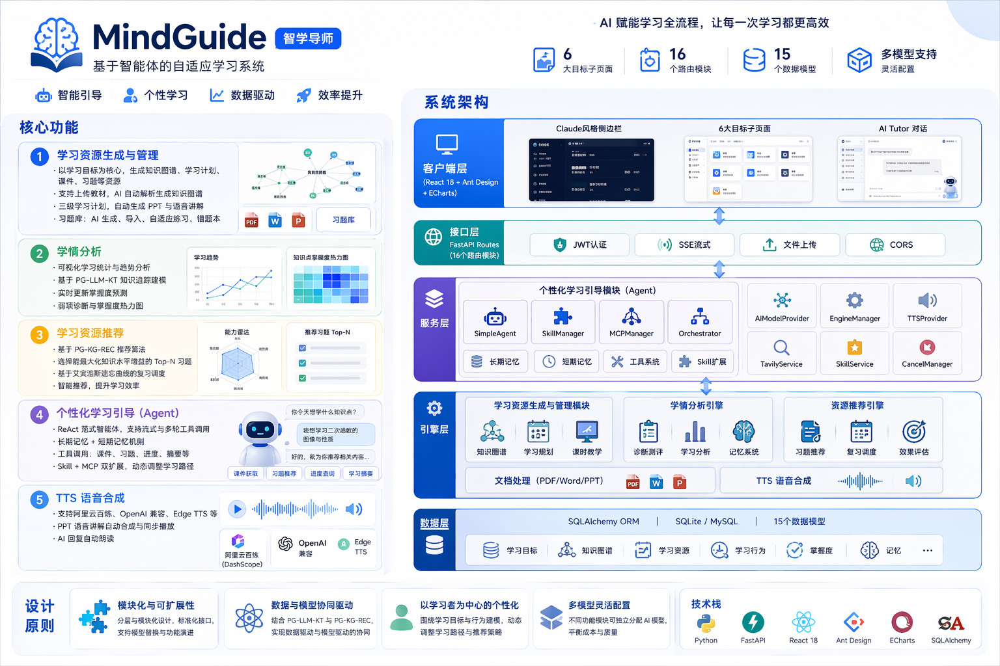

# MindGuide - 基于智能体的自适应学习系统

MindGuide（智学导师）是一款基于智能体（Agent）架构的自适应学习系统，采用 B/S 架构设计，以学习目标为核心组织单元，引入大模型驱动的智能体进行个性化学习引导，为学习者提供学习资源生成、学情分析、资源推荐和个性化学习引导等核心功能。



## 背景与问题

传统在线学习平台存在以下不足：

- **学习资源生成成本高**：依赖教师或专家编写，学习资源更新周期长
- **个性化建模不足**：缺乏学生知识建模与个性化资源推荐能力
- **学习引导缺失**：学生缺乏导师个性化引导和答疑支持

MindGuide 针对上述问题，提供了一套完整的自适应学习解决方案。

## 核心功能

### 1. 学习资源生成与管理

- 以学习目标为核心组织单元，围绕目标生成知识图谱、学习计划、课件、习题等资源
- 支持上传 PDF/Word/PPT 等教材构建专属学习资料库，AI 自动解析并生成知识图谱
- 知识图谱支持 ECharts 可视化展示与手动编辑
- 学习计划支持章-节-课时三级结构，自动生成 PPT 课件与语音讲解
- 习题库支持 AI 生成、文件上传导入、自适应练习与错题本

### 2. 学情分析

- 可视化统计分析：学习进度、练习正确率、学习趋势、学习偏好等
- 结合 **PG-LLM-KT 知识追踪模型** 建模学生知识掌握状态
- 实时更新学习记录与掌握度预测
- 弱项诊断与知识点掌握度热力图

### 3. 学习资源推荐

- 基于 **PG-KG-REC 学习资源推荐算法**
- 从习题库中选择能最大化学生知识水平增益的 Top-N 个习题
- 基于艾宾浩斯遗忘曲线的智能复习调度
- 智能推荐策略提升学习效率

### 4. 个性化学习引导（Agent）

- **ReAct 范式智能体**：基于推理+行动的对话 Agent，支持流式响应与多轮工具调用
- **长期记忆与短期记忆机制**：持续记录学习行为与交互反馈
- **工具调用系统**：支持课件获取、习题推荐、进度查询、学习摘要等
- **Skill + MCP 双扩展**：通过 Skill 系统和 MCP 协议灵活扩展智能体能力
- **自适应教学策略**：在持续交互中动态调整学习路径

### 5. TTS 语音合成

- 支持阿里云百炼（DashScope）、OpenAI 兼容、Edge TTS 等多种语音合成引擎
- PPT 课件语音讲解自动合成与同步播放
- AI 回复自动朗读

## 设计原则

| 原则 | 描述 |
|------|------|
| 模块化与可扩展性 | 分层与模块化设计，标准化接口，支持模型替换与功能演进 |
| 数据与模型协同驱动 | 结合 PG-LLM-KT 与 PG-KG-REC 模型，实现数据驱动与模型驱动的协同 |
| 以学习者为中心的个性化 | 围绕学习目标与行为建模，动态调整学习路径与推荐策略 |
| 多模型灵活配置 | 不同功能模块可独立分配 AI 模型，平衡成本与质量 |

## 系统架构

```
┌─────────────────────────────────────────────────────────────┐
│                       客户端层                                │
│            (React 18 + Ant Design + ECharts)                 │
│   Claude风格侧边栏 │ 6大目标子页面 │ AI Tutor 对话           │
├─────────────────────────────────────────────────────────────┤
│                       接口层                                  │
│              FastAPI Routes (16个路由模块)                     │
│         JWT认证 │ SSE流式 │ 文件上传 │ CORS                   │
├─────────────────────────────────────────────────────────────┤
│                       服务层                                  │
│  ┌────────────────────────────────────────────────────────┐  │
│  │            个性化学习引导模块（Agent）                    │  │
│  │  SimpleAgent │ SkillManager │ MCPManager │ Orchestrator │  │
│  │  长期记忆    │  短期记忆    │  工具系统   │  Skill扩展    │  │
│  └────────────────────────────────────────────────────────┘  │
│  AIModelProvider │ EngineManager │ TTSProvider               │
│  TavilyService   │ SkillService  │ CancelManager             │
├─────────────────────────────────────────────────────────────┤
│                       引擎层                                  │
│  ┌──────────────┐ ┌──────────────┐ ┌──────────────┐         │
│  │ 学习资源生成  │ │   学情分析    │ │  资源推荐    │         │
│  │  与管理模块   │ │    引擎       │ │   引擎       │         │
│  └──────────────┘ └──────────────┘ └──────────────┘         │
│  知识图谱 │ 学习规划 │ 课时教学 │ 诊断测评 │ 记忆系统        │
│  文档处理（PDF/Word/PPT）  TTS语音合成                       │
├─────────────────────────────────────────────────────────────┤
│                       数据层                                  │
│    SQLAlchemy ORM │ SQLite/MySQL │ 15个数据模型               │
│   学习目标 │ 知识图谱 │ 学习资源 │ 学习行为 │ 掌握度 │ 记忆   │
└─────────────────────────────────────────────────────────────┘
```

## 技术架构

```
AI_Tutor/
├── backend/                        # FastAPI 后端
│   ├── app/
│   │   ├── main.py                # 应用入口
│   │   ├── schemas.py             # Pydantic 数据验证
│   │   ├── core/                  # 核心配置
│   │   │   ├── config.py          # 全局配置（环境变量）
│   │   │   ├── database.py        # 数据库连接
│   │   │   └── model_config.py    # 多模型配置管理
│   │   ├── api/                   # API 层
│   │   │   ├── router.py          # 统一路由注册（16个模块）
│   │   │   ├── deps.py            # 依赖注入（JWT认证）
│   │   │   └── routes/            # 各模块路由
│   │   │       ├── chat.py            # Agent 对话（SSE流式）
│   │   │       ├── knowledge_graph.py # 知识图谱
│   │   │       ├── learning_plan.py   # 学习规划与PPT生成
│   │   │       ├── question.py        # 习题库
│   │   │       ├── practice.py        # 练习巩固
│   │   │       ├── tts.py             # TTS语音合成
│   │   │       └── ...
│   │   ├── agent/                 # Agent 智能体模块
│   │   │   ├── agent.py           # SimpleAgent（ReAct对话Agent）
│   │   │   ├── orchestrator.py    # 工具编排器
│   │   │   ├── skill_manager.py   # Skill管理器
│   │   │   ├── mcp_manager.py     # MCP客户端管理器
│   │   │   └── tools/             # 内置工具
│   │   │       ├── lesson_ppt_tool.py     # 课件交付
│   │   │       ├── section_exercise_tool.py # 习题交付
│   │   │       └── study_session_tool.py  # 学习会话管理
│   │   ├── engines/               # 核心引擎
│   │   │   ├── knowledge_graph_engine.py  # 知识图谱引擎
│   │   │   ├── learning_plan_engine.py    # 学习规划引擎
│   │   │   ├── lesson_engine.py           # 课时教学引擎
│   │   │   ├── assessment_engine.py       # 诊断测评引擎
│   │   │   ├── memory_engine.py           # 记忆系统引擎
│   │   │   ├── analysis_engine.py         # 学情分析引擎
│   │   │   └── document_processor.py      # 文档处理引擎
│   │   ├── models/                # 数据模型（15个ORM模型）
│   │   ├── services/              # 业务服务
│   │   │   ├── ai_model_provider.py       # AI模型适配器
│   │   │   ├── engine_manager.py          # 引擎管理器
│   │   │   ├── tts_provider.py            # TTS多提供商抽象层
│   │   │   ├── dashscope_tts_service.py   # 阿里云TTS
│   │   │   ├── streaming_tts.py           # 流式TTS
│   │   │   ├── tavily_service.py          # 联网搜索
│   │   │   ├── skill_service.py           # Skill CRUD
│   │   │   └── cancel_manager.py          # 任务取消管理
│   │   └── prompts/               # 提示词模板
│   ├── config/
│   │   └── mcp_servers.json       # MCP Server 配置
│   ├── model_config.json          # 多模型配置文件
│   ├── .env / .env.example        # 环境变量
│   ├── requirements.txt           # Python 依赖
│   └── mindguide.db               # SQLite 数据库
├── frontend/                       # React 前端
│   ├── src/
│   │   ├── App.jsx                # 路由配置
│   │   ├── layouts/
│   │   │   └── MainLayout.jsx     # 主布局（Claude风格侧边栏）
│   │   ├── pages/                 # 页面组件
│   │   │   ├── Chat.jsx               # AI Tutor 对话页
│   │   │   ├── Settings.jsx           # 系统设置页
│   │   │   ├── SkillManagement.jsx    # Skill 管理页
│   │   │   ├── AgentPrompt.jsx        # Agent 提示词编辑
│   │   │   ├── LandingPage.jsx        # 着陆页
│   │   │   ├── Login.jsx / Register.jsx
│   │   │   └── goal/                  # 学习目标子页面
│   │   │       ├── KnowledgeGraph.jsx # 知识图谱
│   │   │       ├── LearningPlan.jsx   # 学习计划
│   │   │       ├── Analysis.jsx       # 学情分析
│   │   │       ├── Materials.jsx      # 学习资料
│   │   │       ├── Questions.jsx      # 习题库
│   │   │       └── ChatHistory.jsx    # 学习记录
│   │   ├── components/            # 公共组件
│   │   │   ├── ChatPPTVisualizer.jsx  # PPT可视化播放器
│   │   │   ├── ChatInputBar.jsx       # 聊天输入栏
│   │   │   ├── CanvasPanel.jsx        # 画布面板
│   │   │   ├── MermaidRenderer.jsx    # Mermaid 图表渲染
│   │   │   ├── ExercisePractice.jsx   # 练习作答
│   │   │   └── LearningStyle.jsx      # 学习风格分析
│   │   └── utils/
│   │       ├── api.js             # API 封装（Axios + SSE）
│   │       └── audioQueue.js      # 音频播放队列
│   ├── vite.config.js             # Vite 配置（含API代理）
│   └── package.json               # 前端依赖
├── start.ps1                       # Windows 一键启动脚本
└── README.md
```

## 快速开始

### 一键启动（Windows）

```powershell
.\start.ps1
```

脚本会自动检查环境并启动后端（8000端口）和前端（5173端口）。

### 手动启动

**后端：**

```bash
cd backend
python -m venv venv
# Windows:
venv\Scripts\activate
# Linux/Mac:
source venv/bin/activate
pip install -r requirements.txt
cp .env.example .env   # 编辑配置 AI 模型
uvicorn app.main:app --reload
```

**前端：**

```bash
cd frontend
npm install
npm run dev
```

### 访问地址

| 地址 | 说明 |
|------|------|
| http://localhost:5173 | 前端界面 |
| http://localhost:8000 | 后端 API |
| http://localhost:8000/docs | Swagger API 文档 |
| http://localhost:8000/health | 健康检查 |

## 环境配置

### AI 模型配置

复制 `backend/.env.example` 为 `backend/.env`，选择以下方式之一：

**方式一：本地 Ollama（推荐）**

```bash
# 安装 Ollama 后拉取模型
ollama pull qwen3.5:9B
```

```env
CURRENT_PROVIDER=ollama
OLLAMA_BASE_URL=http://localhost:11434
OLLAMA_MODEL=qwen3.5:9B
```

**方式二：云端 API**

```env
CURRENT_PROVIDER=custom
CUSTOM_API_KEY=your_api_key
CUSTOM_API_BASE_URL=https://dashscope.aliyuncs.com/compatible-mode/v1
CUSTOM_MODEL=qwen-plus
```

支持的云端服务：通义千问、DeepSeek、智谱 AI、OpenAI 及其他 OpenAI 兼容 API。

**方式三：前端设置页配置**

启动系统后，登录并进入 **设置** 页面，可在图形界面中添加多组模型 API、为各功能模块分配不同模型。

### 多模型按模块分配

系统支持为不同功能模块分配不同 AI 模型：

| 模块 | 说明 | 推荐模型 |
|------|------|----------|
| 知识图谱生成 | 分析学习资料生成图谱 | 视觉模型或大参数模型 |
| 学习计划生成 | 生成章节式学习计划 | 大参数模型 |
| 课件生成 | 生成教学 PPT | 大参数模型 |
| 习题生成 | 生成练习题和测评 | 中等参数模型 |
| Agent 交互 | AI 对话助手 | 响应速度优先 |

### TTS 语音合成配置

在设置页配置 TTS 引擎：

| 提供商 | 特点 |
|--------|------|
| 阿里云百炼（DashScope） | 16种中文音色，qwen3-tts-flash |
| OpenAI 兼容 | 支持 /v1/audio/speech 接口 |
| Edge TTS | 完全免费，无需 API Key |

## 环境要求

- Python 3.10+
- Node.js 16+
- Ollama（本地模型）或云端 AI API

## 技术栈

### 后端

| 类别 | 技术 |
|------|------|
| Web 框架 | FastAPI + Uvicorn |
| AI 集成 | LangChain + OpenAI SDK |
| 数据库 | SQLAlchemy + SQLite/MySQL + Alembic |
| 数据校验 | Pydantic + Pydantic Settings |
| 认证 | JWT（python-jose + passlib） |
| 文档处理 | PyPDF2 + pdfplumber + python-docx + python-pptx + PyMuPDF |
| TTS 语音 | DashScope SDK + Edge TTS |
| 联网搜索 | Tavily API |
| MCP 协议 | mcp SDK（SSE/Stdio） |

### 前端

| 类别 | 技术 |
|------|------|
| 框架 | React 18 + Vite 5 |
| UI 组件 | Ant Design 5 |
| 状态管理 | Zustand |
| 图表可视化 | ECharts + Mermaid |
| 动画 | Framer Motion |
| 网络请求 | Axios + Fetch（SSE） |
| 文档预览 | pdfjs-dist + mammoth + pptxgenjs |
| Markdown | react-markdown + remark-gfm |

### 数据库

- SQLite（默认，开箱即用）
- 支持扩展为 MySQL

## 许可证

MIT License
